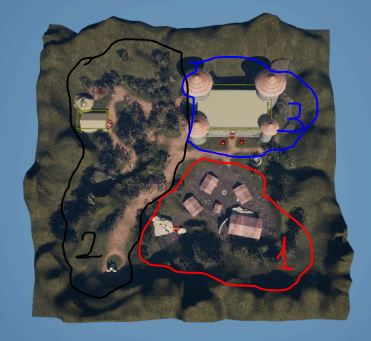
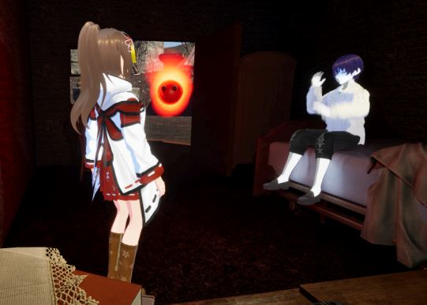
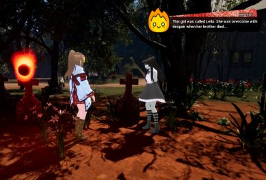
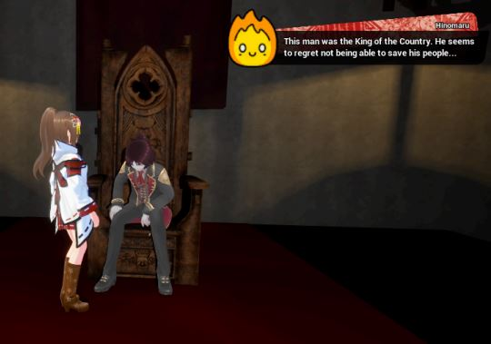

# Land of the Forgotten

This repository contains information on a prototype developed with Unreal Engine 5, which may be expanded to form a full sized game later on. It was created for educational purposes as the final project for the [videogame development degree](https://www.ull.es/masteres/desarrollo-videojuegos/) in University of La Laguna.

**The aim of this project has been the development of a prototype for a videogame that, as part of its core mechanics, includes the usage of the japanese language.** Writing specific japanese characters will be required to interact with certain elements of the level and make progress in the game. In this way, the game intends to aid people interested in learning the language to memorize these symbols in a more enjoyable way.

The prototype was built using C++ classes together with Blueprints. Most logic for all the in-game actors or components are written in C++, whereas their Blueprint counterparts are used to easily customize the actor properties and assign a proper location for their subcomponents in the viewport.

> [!NOTE]
> TODO: Add link to the TFM document for more details.

## Game overview

### 📖 Synopsis

_"Land of the Forgotten"_ follows the adventures of Miko, a young priestess with supernatural powers who's able to see the ghosts of people who, for one reason or another, weren't able to pass on when they died and remain trapped between this realm and the other side. Those poor souls, lost and forgotten, are just awaiting for someone to call their name for the last time...

Miko has the ability to cast spells by writing in her magic cards, and she'll be able to use them to put these lost souls at ease and allow them to ascend to Heaven.

Taking upon the mission of saving those poor souls, Miko travels around the world to find and save as many as she can. Her loyal friend, Hinomaru, a small flame with a life of its own, will accompany her on this journey and help her to accomplish her mission.

### 🎥 Live preview

The following link redirects to a video that shows how the gameplay for the prototype looks like:

- [Land of the Forgotten - Prototype Gameplay Preview](https://youtu.be/BYBBgxvk3L4)

### 🎮 Playable demo

The following controls have be defined for this game:

| Action | Device | Button |
| --- | --- | --- |
| Move | ⌨️ | Directional arrows |
| Jump | ⌨️ | Space |
| Interact | ⌨️ | Left Ctrl |
| Cancel | ⌨️ | Left Alt |
| Draw | 🖱️ | Left click |
| Look / Rotate camera | 🖱️ | Move |

> [!WARNING]
> No playable demo is available for the time being. Sorry for the inconvenience!

## Prototype breakdown

In this section we'll briefly describe the main features of the developed prototype, which consists of a single playable level where the **goal is to save all 3 lost souls available on the map**.

### 🎎 Main character

During the game, players will be able to control Miko. Besides the basic movement actions (like walking or jumping), she also has the ability to cast magic when interacting when certain elements of the scene.

The core mechanic of the game lies in her skill to use cards of different types, which will yield different effects depending on what she's interacting with. **Activating a card to successfully cast a spell requires that the player draws a specific shape in it**, which is where the usage of the japanese language comes into play.

Each card available in Miko' skill set represents one symbol in any of the 3 japanese alphabets: _hiragana_, _katanana_ and _kanji_. The first two alfabets will only be relevant when interacting with the lost souls the player needs to rescue to complete the game. The _kanji_, however, will also be key to solve puzzles and proceed through the game.

To share some specific examples, using a fire card will allow the player to lit up torches or burn certain obstacles. Similarly, wind cards can be used to break walls and water cards can dispel fire.

In the following video we can see this mechanic in action, with Miko using a fire card to lit a torch. As we can see here, activating it requires that the player successfully writes the _kanji_ that means "fire".

### 👾 Guide character

Miko's companion, Hinomaru, is a second in-game character which is controlled via an AI controller. His behaviour is pretty simple, and he'll be mostly following Miko around all the time. He has, however, a passive skill which can aid the players when searching for lost souls to rescue.

Equipped with a soul sight sense (using the AI perception system provided by the engine), Hinomaru will be able to perceive lost souls nearby.

Normally he'd take the shape of a yellow flame, but once a lost soul enter his range of vision, he'll change to a redish color to let the player know that something's close.

This behaviour is illustrated in the attached picture:

### 🗺️ Game level overview

The game prototype consists of a single playable level where the **goal is to save all 3 lost souls available on the map**.

The following screenshot shows the world map of said level, seen from above:

As we can appreciate in the picture, the map contains 3 main areas, which are:

1. The burned village
2. The forest around the church
3. The castle

**There's one lost soul to be found in each of these areas**, as well as some collectible items all around the scene. The latter are completely optional: collectibles only grant extra points to the final score the user will get at the end, but it's not necessary to find any of them in order to complete the level.

Although the order in which the player rescues the 3 souls in the level is irrelevant, in the upcoming paragraphs we'll include a walkthrough to quickly complete the game. This will mostly match what you can see in the gameplay video attached in the ["Live preview" section](#-live-preview) of this page.

### Step 1: The burned village

The lost soul hidden in the village it's pretty easy to find: it's located in the small house at the front of the well. All the player has to do to reach it is to open the door, and he'll see Minoru there, sitting on the bed.

### Step 2: The forest

The second lost soul, Leila, is located in the graveyard at the right of the church, which lies in the forest.

There's no obstacles in the way, so she can be reached without interacting without any door or obstacle. However, with all the trees it's possible the player may not notice her at first, so Hinomaru' soul detection ability will be particularly helpful to spot her.

### Step 3: The castle

The last of the souls in the level, the king, can be found in the throne room inside the castle.

Although the player starts the game right in front of the castle gates, those are initially locked. Opening this gate will require all the 4 torches across the level to be lit.

After we rescue Leila, we can find one of these torches inside the church. Note that there's some plant blocking the entrance, but Miko can open the way by using a fire card to burn it.

The remaining torches are all pretty close to the castle gates: two of them are right in front of the gates, while the other can be found by taking the small road leading to the right side of the castle.

Once the player has succeeded in using fire in all the 4 angelic statues, the path will open and they'll be able to enter the castle and seek the king to complete the game.

## Additional project information

### 🖥️ Project specs

- **Unreal Engine:** 5.3.2
- **Visual Studio:** Community, 2022
- **Operating System:** Windows 10, 64 bits

### 🎨 Resources

- [Mixamo](https://www.mixamo.com/)
- [VRoid Studio](https://vroid.com/en/studio)
- [KanjiVG](https://kanjivg.tagaini.net/listing.html)
- [FlatIcon](https://www.flaticon.com/)
- [Freepik](https://www.freepik.com/)
- [Mixkit](https://mixkit.co/)
- [Pixabay](https://pixabay.com)
- [Dafont: Roman Antique](https://www.dafont.com/es/roman-antique.font)
- [Infinity Blade: Grass Lands](https://www.unrealengine.com/marketplace/en-US/product/infinity-blade-plain-lands)
- [Sketchfab: Throne](https://sketchfab.com/3d-models/throne-bfc6d2989bb0411d9572733d35c3e6d1)
- [Sketchfab: Fox Doll](https://sketchfab.com/3d-models/file-doll-df99c885bf3a4f60ae69b01c81eb6dfa)
- [Sketchfab: Square Gothic Window](https://sketchfab.com/3d-models/square-gothic-window-type3-b98fadbe69194aa3b41d2882f3fffe72)
- [Megascans Trees: European Black Alder](https://www.unrealengine.com/marketplace/en-US/product/megascans-trees-european-black-alder-early-access)
- [FAB: Stylized Dungeon Pack](https://www.fab.com/listings/c6e91312-202a-4d80-a6f1-1b374bb27dce)
- [Unreal Marketplace: EF Edie Room](https://www.unrealengine.com/marketplace/en-US/product/ef-edie)

### 🔗 References

> [!IMPORTANT]
> This section is a work in progress.

- [Unreal University - How to make A Paint System in Unreal Engine](https://www.youtube.com/watch?v=wIfovfaf01w)

TODO: Add name to all relevant links and remove the rest

- [Unreal Engine Docs - Level Stream With C++](https://docs.unrealengine.com/4.27/en-US/BuildingWorlds/LevelStreaming/HowTo/StreamWithCPP/)
- [Epic Games Dev Community - Using Niagara in C++](https://dev.epicgames.com/community/learning/tutorials/Gx5j/using-niagara-in-c)

https://jisho.org/
https://forums.unrealengine.com/t/i-cant-seem-to-get-the-perception-system-working-at-all/2015233
https://www.youtube.com/watch?v=wIfovfaf01w
https://www.reddit.com/r/blenderhelp/comments/vihke6/anyone_know_how_to_export_fbx_from_blender_with/
https://forums.unrealengine.com/t/mixamo-animations-different-skeleton/477861/4
https://www.reddit.com/r/unrealengine/comments/xn6yqm/problem_with_read_render_target_raw_pixel_node/
https://www.youtube.com/watch?v=bb_yw5Cvs6k
https://forums.unrealengine.com/t/drawing-to-render-target-vs-painting-pixels-directly-in-the-texture-and-saving-it/2106067/2
https://forums.unrealengine.com/t/how-to-make-a-image-to-follow-cursor-in-click/445867
https://www.youtube.com/watch?v=b1_efR9hrT4
https://forums.unrealengine.com/t/mixamo-animations-different-skeleton/477861
https://forums.unrealengine.com/t/mesh-contains-root-bone-as-root-but-animation-doesnt-contain-the-root-track/27800/8
https://forums.unrealengine.com/t/how-can-i-export-3d-modeling-from-blender-to-unreal-engine-with-texture/1257528/4
https://www.reddit.com/r/blenderhelp/comments/vihke6/anyone_know_how_to_export_fbx_from_blender_with/
https://www.youtube.com/watch?v=UA3rSNfn9NM
https://www.youtube.com/watch?v=QPjmYSakoek
https://www.reddit.com/r/unrealengine/comments/zzv6ej/imported_bone_transform_is_different_from/
https://forums.unrealengine.com/t/blender-to-ue4-import-error-imported-bone-transform-is-different-from-original/138274/15
https://forums.unrealengine.com/t/how-to-solve-warning-imported-bone-transform-is-different-from-original-error/295577/15
https://www.reddit.com/r/unrealengine/comments/zzv6ej/imported_bone_transform_is_different_from/
https://booth.pm/en/browse/VRoid?in_stock=true&tags%5B%5D=Dresses&max_price=0
https://forums.unrealengine.com/t/quick-ai-perception-jumpstart-c/27452
https://lostferry.com/2-50-using-ai-perception-component-unreal-c/
https://dev.epicgames.com/community/learning/tutorials/8Jp3/unreal-engine-creating-a-custom-sense-for-the-aiperception-system
https://forums.unrealengine.com/t/why-does-the-niagara-child-component-not-move-with-its-parent/443347
https://forums.unrealengine.com/t/c-set-niagara-variable-color-array/669649
https://dev.epicgames.com/documentation/en-us/unreal-engine/metadata-specifiers-in-unreal-engine
https://forums.unrealengine.com/t/draw-debug-lines-for-line-tracing/280307
https://forums.unrealengine.com/t/find-collision-uv-node-doesnt-work/370796/12
https://www.reddit.com/r/unrealengine/comments/g64j69/comment/fwcmtdy/?utm_source=share&utm_medium=web3x&utm_name=web3xcss&utm_term=1&utm_content=share_button
https://forums.unrealengine.com/t/adding-nav-modifier-as-a-component-in-actor-and-via-add-component-by-class-leads-to-a-different-result/670965
https://forums.unrealengine.com/t/spawning-an-actor-with-parameters/329151/6
https://forums.unrealengine.com/t/how-can-i-output-the-value-of-an-enum-to-a-log/285097/10
https://ull-master-videojuegos.github.io/desarrollo3d-apuntes/chapters/colisiones-triggers-y-raycasts.html#consultas-de-superposici%C3%B3n-overlap
https://forums.unrealengine.com/t/find-specific-element-in-tarray/304089/16
https://forums.unrealengine.com/t/how-do-i-play-level-sequence-in-c/771145/2
https://dev.epicgames.com/documentation/en-us/unreal-engine/template-sequences-in-unreal-engine
https://dev.epicgames.com/documentation/en-us/unreal-engine/API/Runtime/LevelSequence
https://www.youtube.com/watch?v=YSPymD_c5s0
https://dev.epicgames.com/documentation/en-us/unreal-engine/interfaces-in-unreal-engine?application_version=5.4
https://forums.unrealengine.com/t/how-to-bind-a-utextblock/334220/8
https://unreal-garden.com/tutorials/ui-animations-from-cpp/
https://www.reddit.com/r/unrealengine/comments/q9t3bm/when_to_use_gamestate_gamemode_and_playerstate/
https://forums.unrealengine.com/t/get-widget-animation-in-c/359116/6
https://forums.unrealengine.com/t/what-should-i-do-in-gamemode-gamestate-and-playerstate/93584/3
https://forums.unrealengine.com/t/settext-ftext-asnumber-mycounter-using-fnumberformatoptions/247640/2
https://forums.unrealengine.com/t/spline-components-through-c/293817/2
https://forums.unrealengine.com/t/howto-set-gameinstance-class-in-c/357414
https://forums.unrealengine.com/t/no-elegant-representation-for-a-manager-class/1589871/4
https://www.reddit.com/r/unrealengine/comments/dhizeu/how_to_play_music_or_an_audio_cue_between_level/
https://unreal-garden.com/tutorials/using-same-function-for-many-ubuttons/#b-bind-to-the-slate-button-widget
https://unreal-garden.com/docs/uproperty/#editanywhere
https://dev.epicgames.com/documentation/en-us/unreal-engine/game-mode-and-game-state-in-unreal-engine?application_version=5.4
https://forums.unrealengine.com/t/how-to-use-the-onaudiofinished-event-in-c/378623
https://forums.unrealengine.com/t/disable-enable-light-at-certain-places/139474/2
https://dev.epicgames.com/documentation/en-us/unreal-engine/chaos-fields-user-guide-in-unreal-engine
https://www.reddit.com/r/unrealengine/comments/xlj2ri/what_is_the_difference_between_a_level_instance/
https://forums.unrealengine.com/t/ai-controller-not-attaching-to-a-spawned-character-in-ue-5/2161581/3
https://www.youtube.com/watch?v=2ZHEOSVs0OI
https://forums.unrealengine.com/t/how-do-i-fix-bcastdynamicshadow-problem/355266/8
https://dev.epicgames.com/community/learning/tutorials/Dl70/unreal-engine-texture-streaming-pool-guide-fix-over-budget-issues-optimize-your-textures
